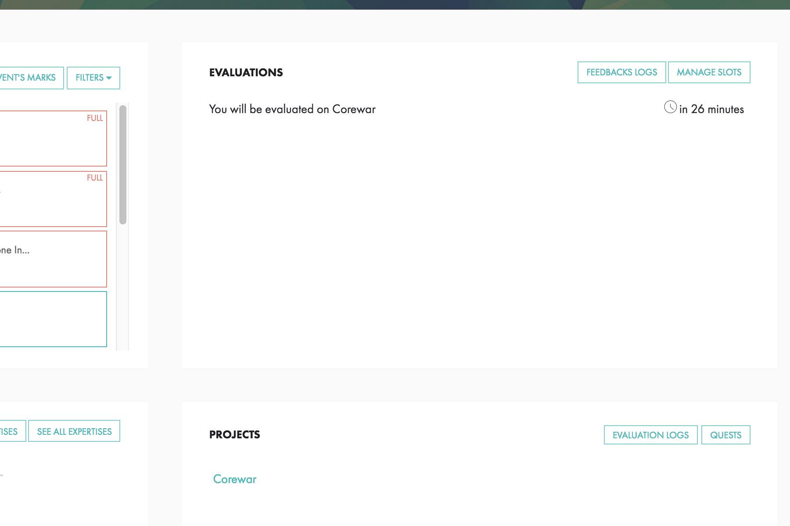
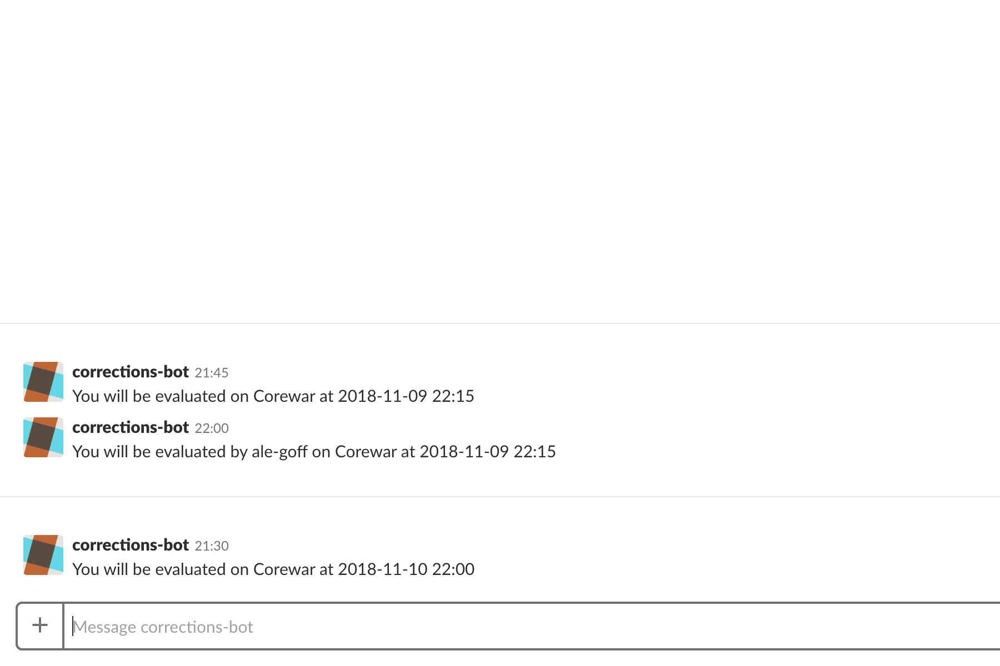
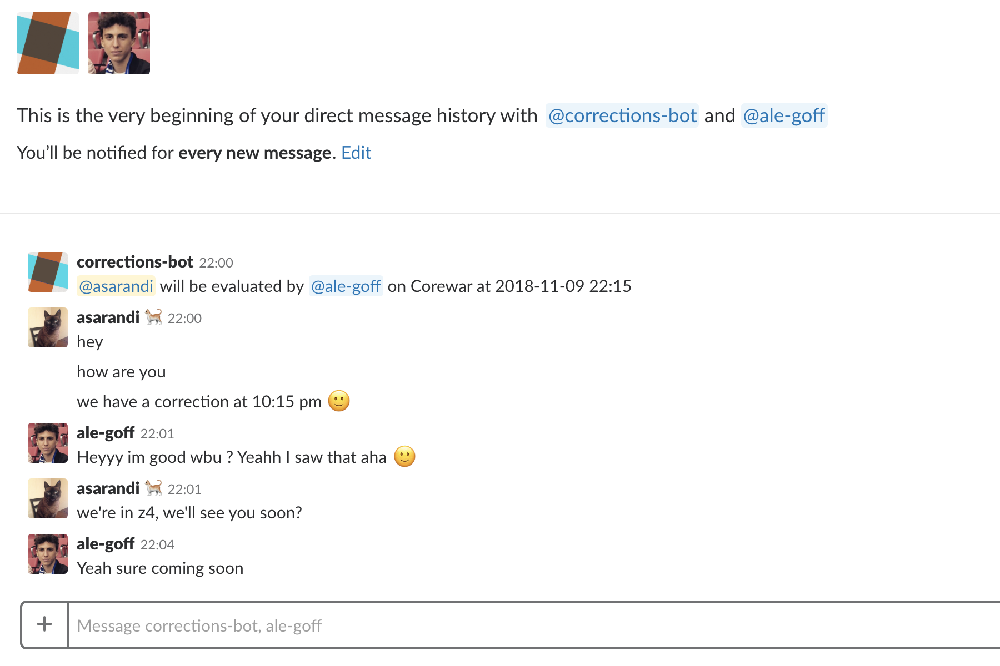
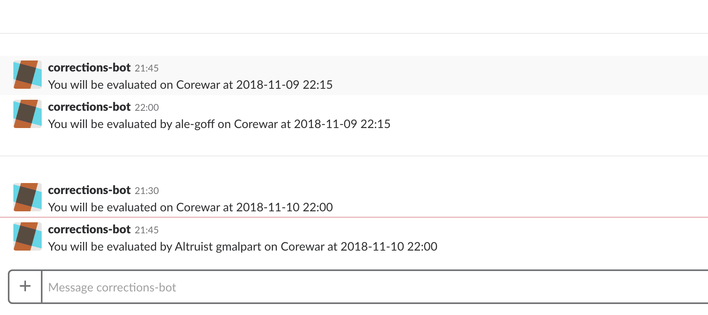
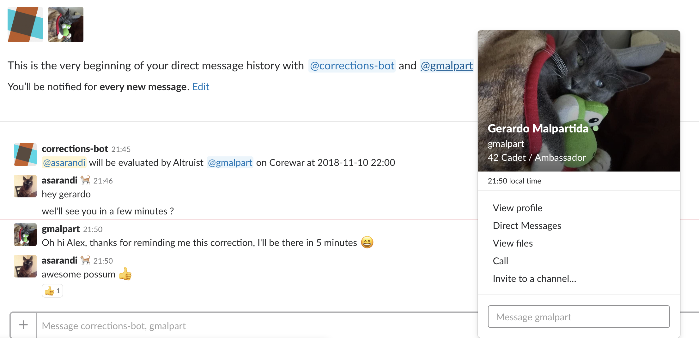
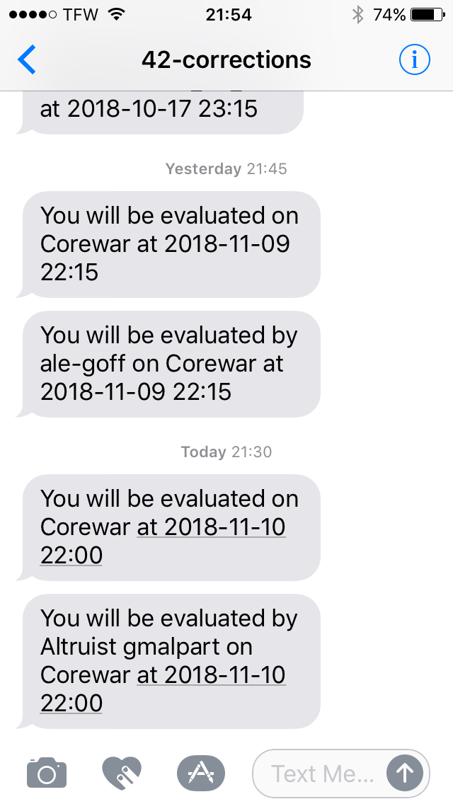

# 42-corrections-bot
parses your intra page and sends a slack notification (and/or sms) when you have a correction
</br>
### install the prerequisites:
```bash
apt install python3-pip
pip3 install bs4
pip3 install twilio
pip3 install slackclient
```
</br>
### edit the script and add your credentials
</br>

### add crontab 
```bash
crontab -e
```
(adjust folder paths as necessary)
```bash
*/15 * * * * cd /home/ubuntu/corrections; /usr/bin/python3 corrections-bot.py >> execution.log 2>&1
```
</br>

### done

</br>
</br>
</br>

#### correction appears on our intra profile page


</br>
</br>
#### bot sends a direct message to owner


</br>
</br>
#### bot sends a group message to owner and correction partner


</br>
</br>
#### bot sends a direct message to owner


</br>
</br>
#### bot sends a group message to owner and correction partner


</br>
</br>
#### bot sends sms message to owner


</br>
</br>
#### bot sends sms message to owner


</br>
